# 武汉大学经管 24 届杨景媛硕士学位论文学术不端指控

> 本文引自知乎作者 [Longhao.Chen 的文章](https://zhuanlan.zhihu.com/p/1932931783806161969) ，根据 CC-BY-SA 4.0 获得授权

[武汉大学硕士论文两个关键错误推翻结论-不要在其他小问题浪费时间](https://www.bilibili.com/video/BV1qPhWzdE2H/)  

[【非错别字格式问题】武汉大学被偷拍(已证伪)女生论文问题，武汉大学你管是不管？](https://www.bilibili.com/video/BV1KM8EzREY4/)  

简要来说，上面两个视频提到杨论文中出现“先射箭再画靶”的问题，而这个问题是可以直接否决杨整篇论文的推导逻辑，简单点说，学位论文存在原理性错误。  

1. 武汉大学经管 24 届杨景媛-硕士学位论文疑点和错误（原：武汉大学诬陷案杨景媛-硕士学位论文疑点和错误）
2. 明显存在严重的内生性问题，对因果关系无论证，到底谁是因谁是果，文章似无详细且严格的论证。杨就是否生育多胎和是否家暴这一组调查数据没有指定因果关系，即可以说是生育多胎导致的家暴数据，也可以说是家暴导致生育多胎的数据，调查数据都这么无价值，那基于这组数据进行的推导更是纯废话。

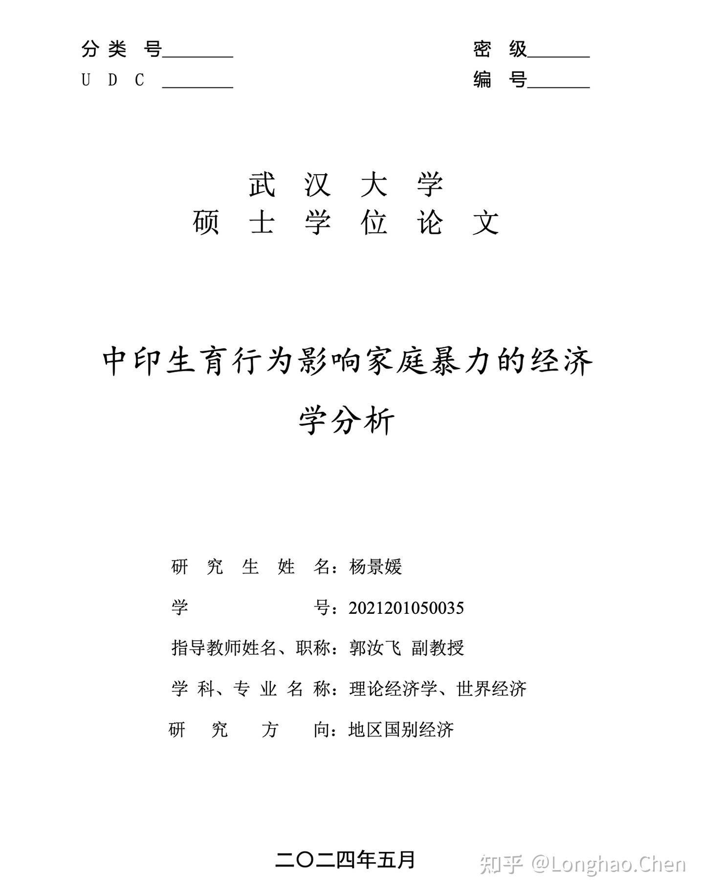

## 1. 数据与参考资料造假

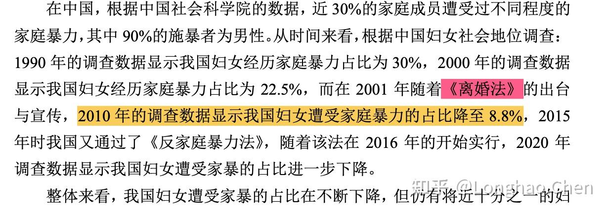

红色高亮部分，《离婚法》实际不存在，为编造，涉嫌违反：

> 《学术出版规范 期刊学术不端行为界定》3.2 伪造： \
> d) 编造能为论文提供支撑的资料、注释、参考文献。

黄色高亮部分，并不能找到相应数据，文中也没有对应的引用。如果数据真实，可能涉嫌违反：

> 《学术出版规范 期刊学术不端行为界定》3.1.2 数据剽窃 \
> a) 不加引注地直接使用他人已发表文献中的数据。

如果数据不真实，可能涉嫌违反：
> 3.2 伪造 \
> a) 编造不以实际调查或实验取得的数据、图片等。

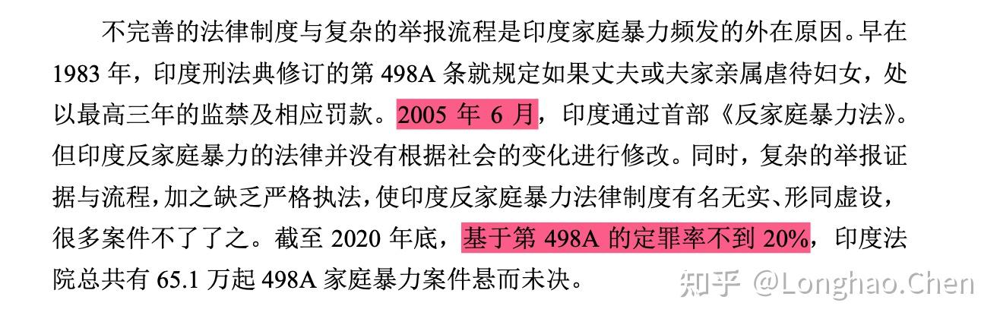

---

经过 [查询](https://link.zhihu.com/?target=https%3A//en.wikipedia.org/wiki/Protection_of_Women_from_Domestic_Violence_Act%2C_2005)，通过日期为 2005 年 9 月 13 日而非 2005 年 6 月。

另外，这一段可能涉嫌违反 `3.1.5 文字表述剽窃`

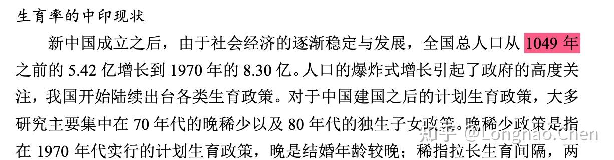

红色部分为编造，与事实不符，可能涉嫌
> 3.2 伪造 \
> b) 伪造无法通过重复实验而再次取得的样品等。

---

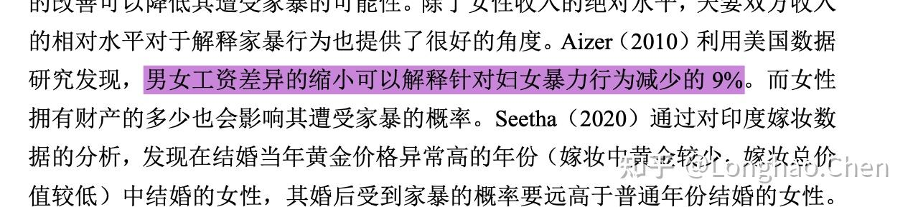

紫色部分引用错误，可能涉嫌
>3.3 篡改 \
> e) 改变所引用文献的本意，使其对己有利。

---

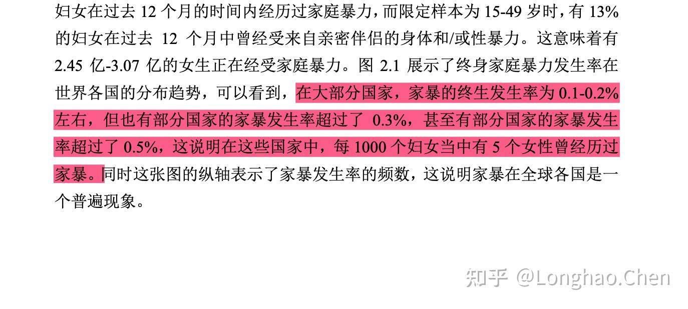

红色部分为编造，与事实不符，可能涉嫌
> 3.2 伪造 \
> b) 伪造无法通过重复实验而再次取得的样品等。

---

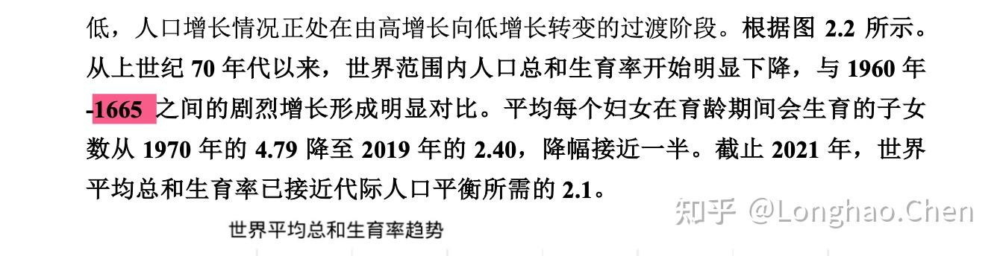

红色部分为编造，与事实不符。可能涉嫌
> 3.2 伪造 \
> b) 伪造无法通过重复实验而再次取得的样品等。

---
## 2. 数据处理与数据拟合问题
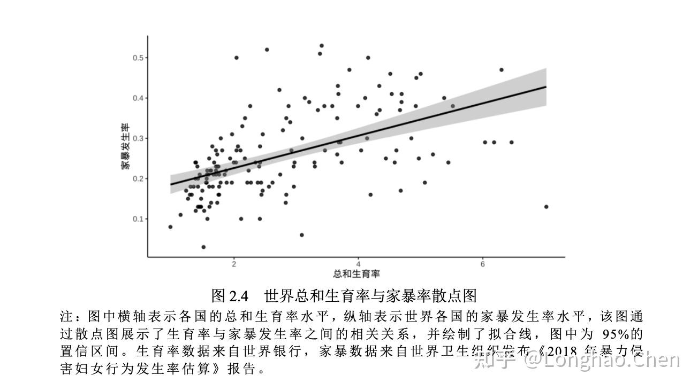

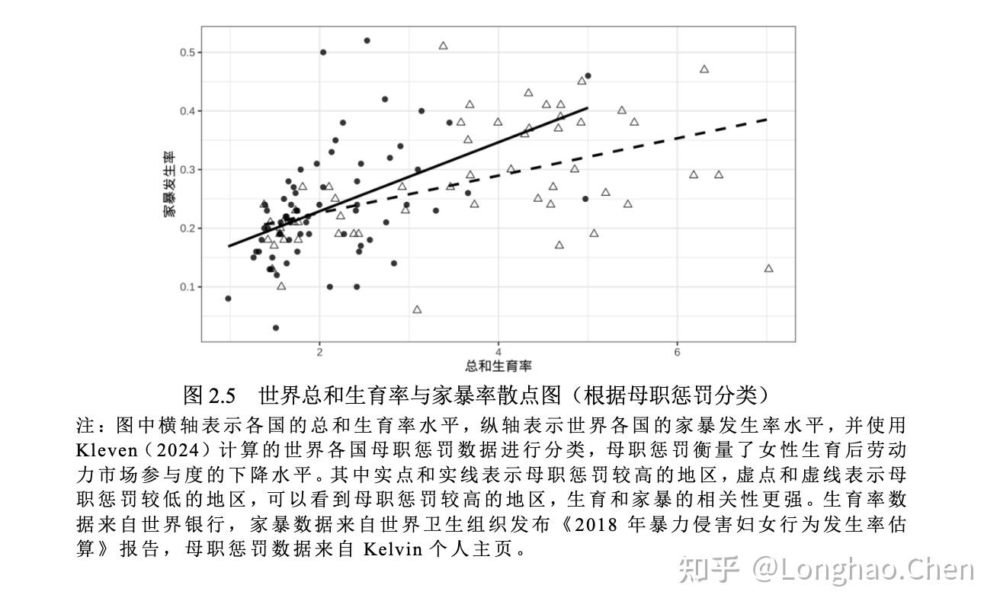

非常抽象的霰形拟合，无须多言。

---

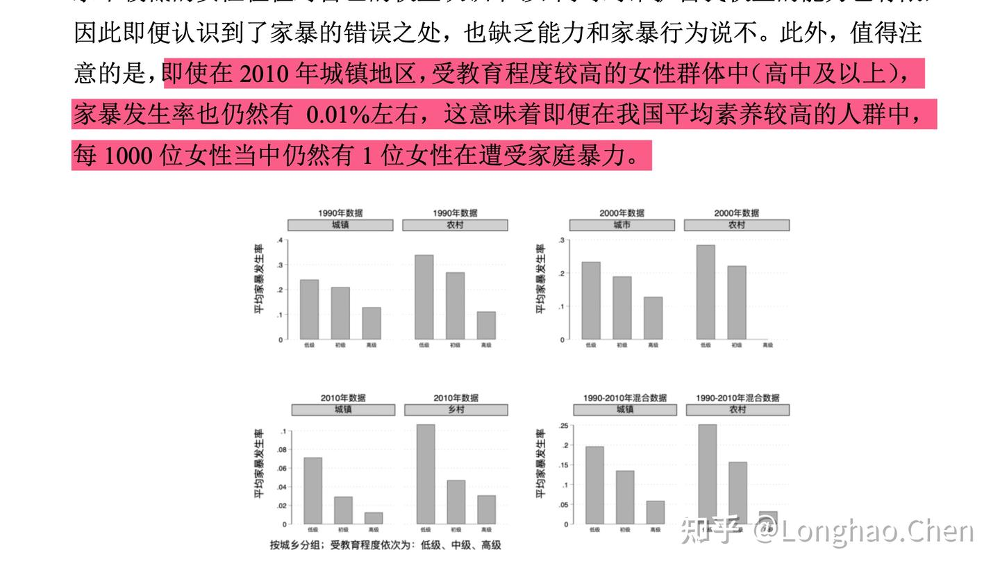

红色部分为编造，与事实不符。可能涉嫌
> 3.2 伪造 \
> b) 伪造无法通过重复实验而再次取得的样品等。

---

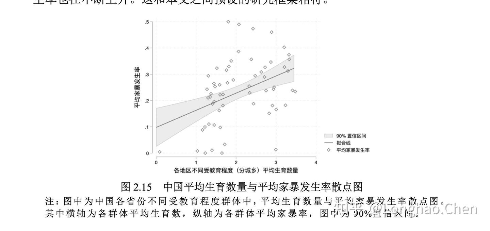

更加离谱的拟合。

---

## 3. 引用文献重复

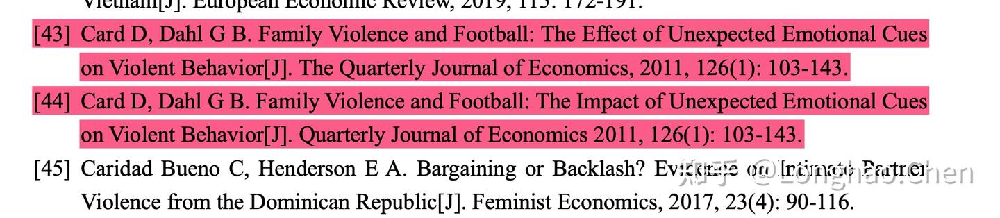

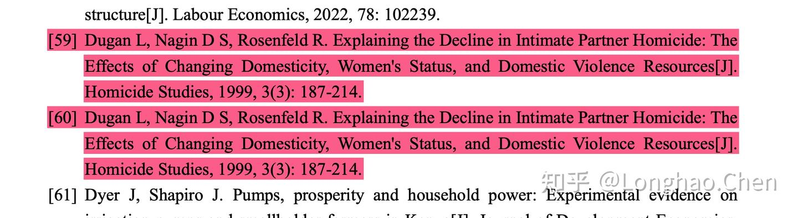

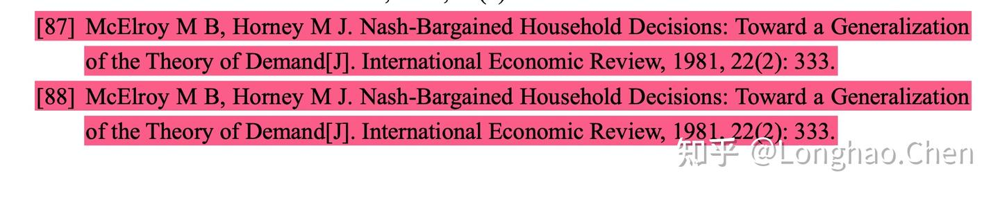

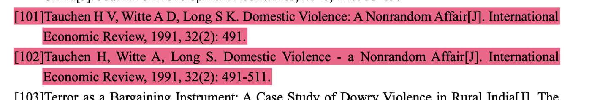

大量的文献重复。

---

## 4. 数值无法自圆其说

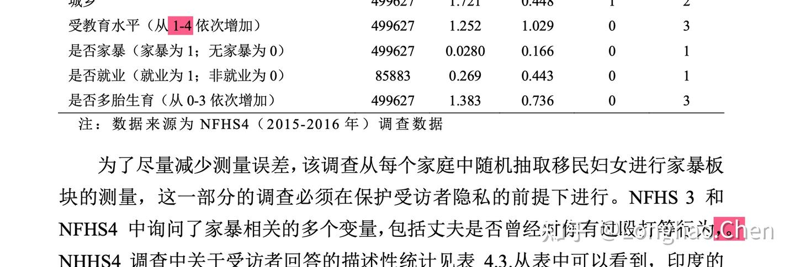

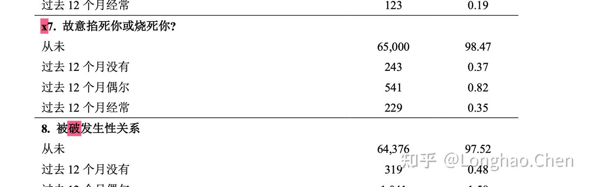

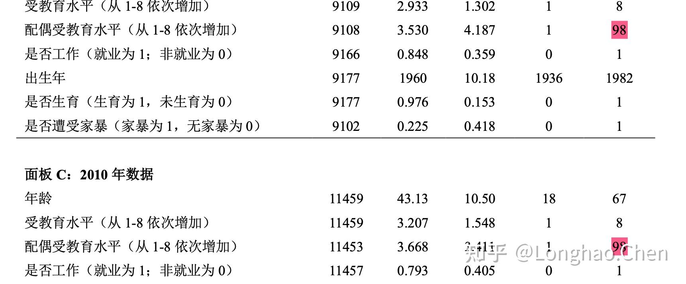

符号、文字使用错误，数值错误。

---

## 5. 推导问题

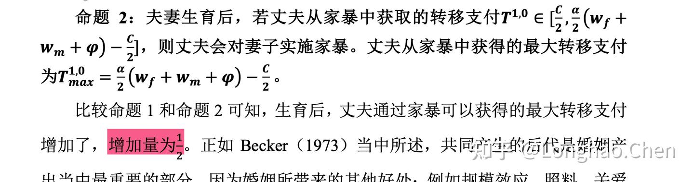

错误，应为 $\cfrac {\alpha} {2} \varphi$

> 其他理论推导的地方用到最复杂的工具就是均值定理，想错都难。

## 6. 参考文献无引用

另外，文中大量引用的 Kelvin（2024），在文末参考文献处找不到，导致无法查证相关数据和应用是否正确。

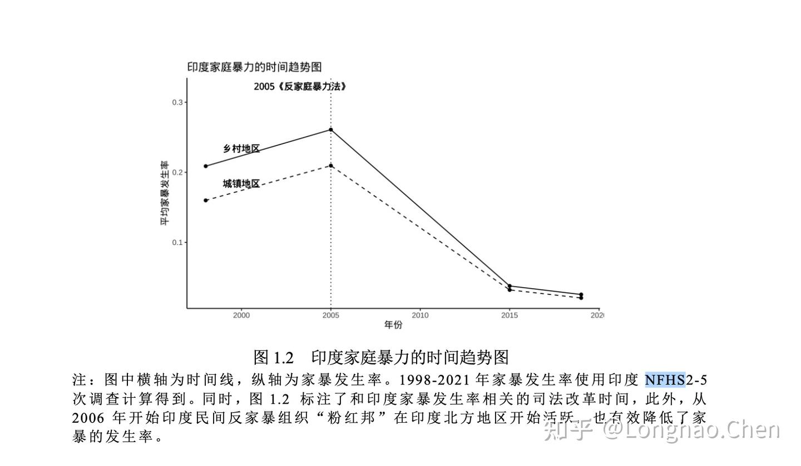

## 7. 数据造假

这个地方说根据 [NFHS2-5](https://zhida.zhihu.com/search?content_id=260898331&content_type=Article&match_order=1&q=NFHS2-5&zhida_source=entity) 的数据绘制出的图，在2005年时对应的是NFHS3的数据，通过查阅 [National Family Health Survey (NFHS-3)](https://link.zhihu.com/?target=https%3A//www.dhsprogram.com/pubs/pdf/FRIND3/FRIND3-Vol1AndVol2.pdf)，在498页我们可以找到：

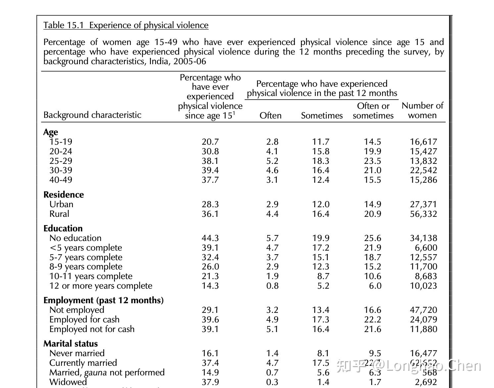

乡村和城镇的数据分布为图 36.1 和 28.3，与图不符。

